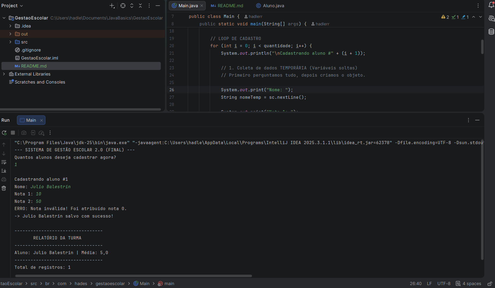

# 🎓 Sistema de Gestão Escolar (Java)

Bem-vindo ao repositório do **Sistema de Gestão Escolar**. Este projeto foi desenvolvido como um desafio prático intensivo ("Code Kata") para consolidar os fundamentos da Programação Orientada a Objetos (POO) e boas práticas de desenvolvimento em Java.

O foco não foi apenas "fazer funcionar", mas sim implementar um código limpo, seguro e escalável, simulando cenários reais de regras de negócio.

## 🚀 Funcionalidades

* **Cadastro de Alunos:** Criação de objetos com validação obrigatória via Construtor.
* **Cálculo Automático de Média:** Lógica de negócio encapsulada dentro da classe `Aluno`.
* **Listagem Dinâmica:** Uso de `ArrayList` para gerenciar uma turma de tamanho indefinido.
* **Relatório de Desempenho:** Exibição formatada dos dados e médias finais.

## 🛡️ Destaques Técnicos (O Diferencial)

Este projeto vai além do básico ao implementar conceitos de **Programação Defensiva** e **Clean Code**:

* **Encapsulamento Rigoroso:** Todos os atributos são `private`. O acesso é feito estritamente via Getters e Setters.
* **Validação de Dados (QA):** O sistema impede a entrada de notas inválidas (ex: notas negativas ou acima de 10). Tentar burlar essa regra resulta em tratamento de erro automático e atribuição de valor seguro (0).
* **Construtores:** Garantia de consistência do objeto — nenhum aluno pode ser instanciado sem nome e notas iniciais.
* **Separação de Responsabilidades:** A classe `Main` cuida apenas da interação (I/O), enquanto a classe `Aluno` detém toda a regra de negócio.

## 🛠️ Tecnologias Utilizadas

* **Linguagem:** Java (JDK 25)
* **IDE:** IntelliJ IDEA
* **Conceitos:** POO, Collections, Tratamento de Exceções, Git/GitHub.

## 💻 Como Executar

1.  Certifique-se de ter o [Java JDK](https://www.oracle.com/java/technologies/downloads/) instalado.
2.  Clone este repositório:
    ```bash
    git clone [https://github.com/hadlerr/estudos-java-poo.git](https://github.com/hadlerr/estudos-java-poo.git)
    ```
3.  Abra o projeto na sua IDE favorita (IntelliJ, Eclipse, VS Code).
4.  Execute o arquivo `src/br/com/hades/gestaoescolar/Main.java`.

## 📝 Exemplo de Uso

```text
--- SISTEMA DE GESTÃO ESCOLAR 2.0 ---
Quantos alunos deseja cadastrar agora? 2

Cadastrando aluno #1
Nome: Maria Silva
Nota 1: 9.5
Nota 2: 8.0
-> Maria Silva salvo com sucesso!

Cadastrando aluno #2
Nome: João Teste
Nota 1: 50  <-- Tentativa de erro
ERRO: Nota inválida! Foi atribuído nota 0.
-> João Teste salvo com sucesso!

... Relatório Final gerado com sucesso ...
```

